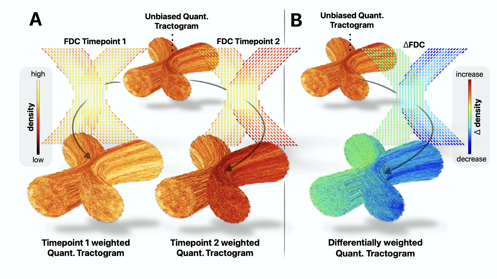

# Robust longitudinal quantitative streamline tractography

This repository includes relevant code to support the results of the manuscript "Longitudinal quantitative streamline tractography: robust estimation of white matter connectivity differences" (future link). Furthermore, it contains a comprehensive step-by-step tutorial for prospective users to apply the presented framework to their own datasets.

## Key idea of the framework

The robust longitudinal quantitative streamline tractography framework presented in this manuscript overcomes limitations of cross-sectional pipelines by enforcing streamline correspondence across timepoints through a single subject-specific **unbiased quantitative tractogram**. This tractogram serves as a baseline for further density optimisation to capture longitudinal changes in white matter connectivity.

Density optimisation of the unbiased quantitative tractogram can be performed using two complementary strategies:

- **Symmetric optimisation**  
  The unbiased quantitative tractogram is optimised separately for each session to match session‑specific fibre densities.

- **Differential optimisation**  
  The unbiased quantitative tractogram is optimised to directly optimised match fibre‑density *differences* between sessions.

<p align="center">
  
</p>

<p align="center">
  <em>
    (A) Symmetric and (B) differential optimisation of an unbiased quantitative tractogram. Figure reproduced from the original manuscript (permission to be obtained from the publisher upon publication).
  </em>
</p>


To run symmetric and differential optimisation using the SIFT2 algorithm, an [updated version of `tcksift2`](https://github.com/MRtrix3/mrtrix3/tree/sift2diff) must be compiled.

---

## Overview

The proposed framework was evaluated in:
- Synthetic diffusion MRI phantoms
- Three in vivo human longitudinal cohorts  

Performance was benchmarked using four pipelines:
- Pipeline 1: session-specific tractograms. 
- Pipeline 2: session-specific tractograms + SIFT2
- Pipeline 3: unbiased tractogram + symmetric SIFT2. 
- Pipeline 4: unbiased tractogram + differential SIFT2.

The repository is organised as follows:

- code/pipeline_phantoms: contains Jupyter notebooks to derive the relevant outputs from phantoms (main_Phantoms.ipynb)
- code/pipeline_in_vivo: contains Python scripts to derive the relevant outputs from in vivo data (main_{Dataset}.py)
- code/figures_paper: contains jupyter notebooks to reproduce the data figures presented in the paper 
- data/phantoms: contains phantom outputs generated by the phantom pipelines
- data/in_vivo: contains connectome outputs and statistical results generated by the in vivo pipelines
- scripts: contains wrapper scripts for unbiased within subject template generation and surgical resection cavity segmentation
- tutorial: contains a comprehensive step-by-step tutorial to apply the presented methods to other datasets


Synthesised dMRI images of the longitudinal phantoms are available for download [elsewhere](https://osf.io/vt8b2/). To run the phantom pipeline on this data, copy the relevant phantoms into "data/phantoms/".

---

# Installation Guide
To run symmetric and differential optimisation an [updated version of the tcksift2 command](https://github.com/MRtrix3/mrtrix3/tree/sift2diff) needs to be compiled. 

```bash
git clone https://github.com/MRtrix3/mrtrix3.git mrtrix3_sift2diff
cd mrtrix3_sift2diff
git checkout sift2diff
./configure -nogui
./build bin/tcksift2
```

This will build only the relevant command without GUI. After compilation, the command can be called by explicitly providing the full path, e.g.:

```bash
path/to/mrtrix3_sift2diff/bin/tcksift2
```

---

## Citation

If you use this framework, the provided code and/or the associated software, please cite:

> Longitudinal quantitative streamline tractography: robust estimation of white matter connectivity differences
> Philip Pruckner, Remika Mito, David N Vaughan, Kurt G Schilling, Victoria L Morgan, Dario J Englot, Robert E Smith
> bioRxiv 2026.02.09.704742; doi: https://doi.org/10.64898/2026.02.09.704742
